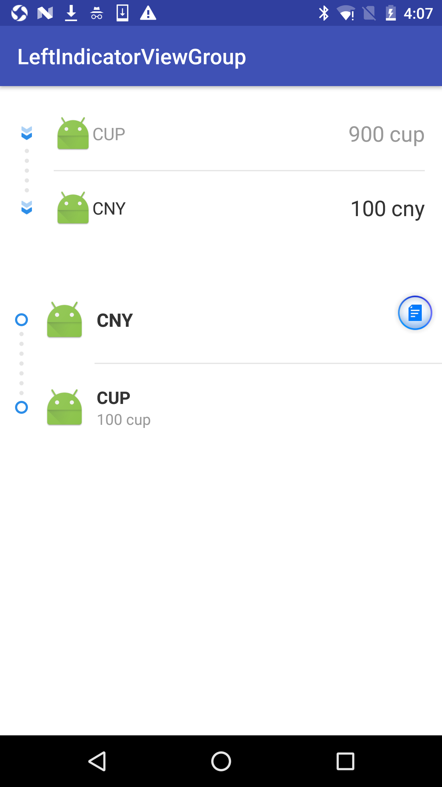

LeftIndicatorViewGroup
======================

A left indicator view group of android.

Please feel free to use this.

# Features

* Simple Left Indicator. support custom icon.


# Demo

### Use Input



# How do I use it?

## Setup

#### Gradle

```groovy
dependencies {
  // jCenter
  compile 'com.carlos.widget:leftindicator:0.0.+'
}
```
###
more details please see the sample.

License
-------

    Copyright 2017, Carlos Luo.

    Licensed under the Apache License, Version 2.0 (the "License");
    you may not use this file except in compliance with the License.
    You may obtain a copy of the License at

       http://www.apache.org/licenses/LICENSE-2.0 

    Unless required by applicable law or agreed to in writing, software
    distributed under the License is distributed on an "AS IS" BASIS,
    WITHOUT WARRANTIES OR CONDITIONS OF ANY KIND, either express or implied.
    See the License for the specific language governing permissions and
    limitations under the License.